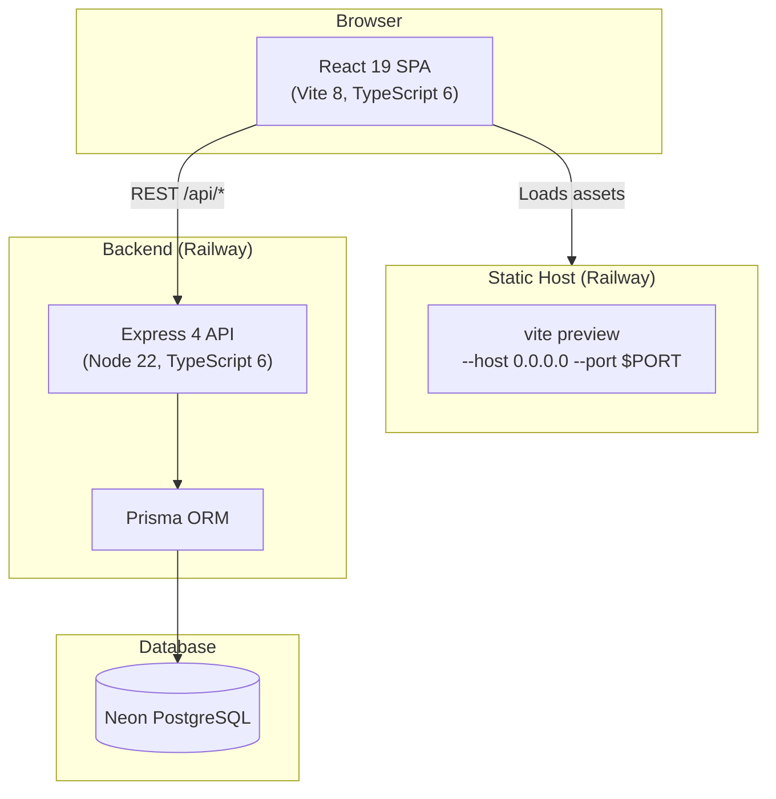

# Studzens — Architecture Overview

## System Diagram



---

## Deployment Architecture

| Layer | Technology | Platform |
|---|---|---|
| Frontend | React 19 + Vite 8 | Railway (static preview) |
| Backend | Express 4 + Node 22 | Railway (always-on service) |
| Database | PostgreSQL | Neon (serverless Postgres) |

Both frontend and backend run inside the same **npm monorepo** but deploy as separate Railway services.

---

## Package Dependency Graph

```
studzens-workspace (root)
├── @studzens/frontend
│   ├── react 19, react-router-dom 7
│   ├── maplibre-gl 5, react-map-gl 8
│   ├── lucide-react 1
│   └── tailwindcss 4 (via @tailwindcss/vite)
│
├── @studzens/backend
│   ├── express 4, cors, helmet, dotenv
│   ├── @studzens/database (workspace:*)
│   ├── @prisma/adapter-pg, pg
│   └── zod (request validation)
│
└── @studzens/database
    ├── prisma (CLI + client)
    └── prisma.config.ts
```

---

## Frontend Architecture

The React SPA follows a **layered architecture**:

```
main.tsx
  └── Global Providers (Auth, Bookmark, Notification, StudentProfile)
        └── App.tsx  (BrowserRouter + Routes)
              └── PageShell  (sticky header, mobile bottom nav)
                    └── <Outlet /> → lazy-loaded Page components
                                          └── shared components & contexts
```

### State Management

| Concern | Mechanism |
|---|---|
| Auth session | `AuthContext` — in-memory + localStorage |
| Saved colleges | `BookmarkContext` — localStorage-backed |
| Student onboarding data | `StudentProfileContext` — localStorage-backed |
| Toast notifications | `NotificationContext` — in-memory queue |
| Page-local UI state | `useState` / `useReducer` inside each page |
| Derived/computed values | `useMemo` + `useSearch` custom hook |

### Code Splitting

All 13 pages are **lazy-loaded** via `React.lazy` + `Suspense`, keeping the initial bundle small. A branded `PageLoader` spinner is shown during navigation.

---

## Backend Architecture

The Express API is intentionally minimal — it is a **thin REST layer** over Prisma:

```
index.ts
  ├── helmet()           ← security headers
  ├── cors()             ← allow frontend origin
  ├── express.json()     ← body parser
  ├── /api/colleges      ← colleges router
  ├── /api/users         ← users router
  ├── /api/reviews       ← reviews router
  └── /api/health        ← health check
```

**Note:** The frontend currently uses **static mock data** (`src/api/mocks/`) and does not make live API calls. The backend is ready for integration and will replace the mocks progressively.

---

## Database Architecture

The Prisma schema defines **10 models** across 4 concern areas:

```
Identity:     User ──── Profile
Content:      College ──┬── Program
                        ├── Placement
                        ├── Facility
                        └── CollegeExam ── Exam
Social:       Review (User × College)
Organisation: Bookmark (User × College)
```

All string primary keys use `@default(uuid())`. Cascade deletes are configured on all child relations.

---

## Security

| Concern | Implementation |
|---|---|
| HTTP headers | `helmet` middleware |
| CORS | `cors` middleware (restrict to known origin in production) |
| Password storage | `passwordHash` field (hashing library TBD) |
| Input validation | `zod` schemas on POST routes |
| Route protection | `ProtectedRoute` component redirects unauthenticated users |

---

## Key Design Decisions

1. **Mock-first frontend** — The SPA ships with rich static data so it can be developed and demonstrated independently of the backend.
2. **Monorepo with npm workspaces** — A single `npm install` at root installs all three packages; no Lerna or Turborepo required.
3. **Vite over CRA** — Faster HMR, native ESM, and superior build performance.
4. **Tailwind 4 via plugin** — Uses `@tailwindcss/vite` instead of PostCSS for tighter Vite integration.
5. **React Router v7** — Uses the latest data-router APIs for future loader/action support.
6. **`${PORT:-4173}` in preview script** — Ensures `$PORT` is expanded by the script's own shell, not by the deployment platform's run-command interpolation.
