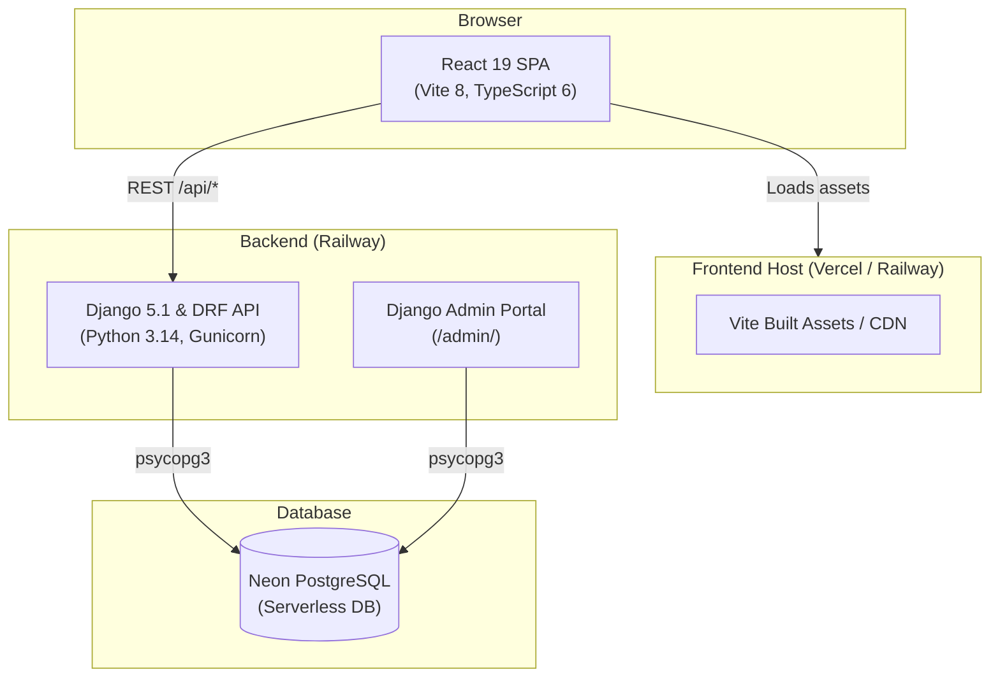

# Studzens — Architecture Overview

## System Diagram



---

## Deployment Architecture

| Layer | Technology | Platform |
|---|---|---|
| Frontend | React 19 + Vite 8 | Vercel / Railway |
| Backend | Django 5.1 + DRF | Railway (Gunicorn WSGI) |
| Database | PostgreSQL | Neon (Serverless Postgres) |

---

## Repository Structure

```
studzens/
├── frontend/             → React 19 SPA (Vite 8, Tailwind CSS, MapLibre GL)
├── backend/              → Django 5.1 Project
│   ├── api/              → DRF App (models, serializers, views, urls, admin)
│   ├── studzens/         → Django settings, root URLs, WSGI
│   ├── manage.py         → Django CLI entrypoint
│   ├── requirements.txt  → Python dependencies
│   ├── Procfile          → Gunicorn process declaration
│   └── seed.py           → Database seed script
└── docs/                 → Architecture & system documentation
```

---

## Frontend Architecture

The React SPA follows a **layered architecture**:

```
main.tsx
  └── Global Providers (Auth, Bookmark, Notification, StudentProfile)
        └── App.tsx  (BrowserRouter + Routes)
              └── PageShell  (sticky header, mobile bottom nav)
                    └── <Outlet /> → lazy-loaded Page components
                                           └── shared components & contexts
```

### State Management

| Concern | Mechanism |
|---|---|
| Auth session | `AuthContext` — JWT Bearer tokens + localStorage |
| Saved colleges | `BookmarkContext` — API synced + localStorage fallback |
| Student onboarding data | `StudentProfileContext` — localStorage-backed |
| Toast notifications | `NotificationContext` — in-memory queue |
| Page-local UI state | `useState` / `useReducer` inside each page |
| Derived/computed values | `useMemo` + `useSearch` custom hook |

---

## Backend Architecture

The Django API is built on **Django REST Framework (DRF)**:

```
backend/
  ├── studzens/settings.py  ← Neon DB, CORS, SimpleJWT, filter backends
  ├── api/models.py         ← 10 Django ORM models
  ├── api/serializers.py    ← ModelSerializers & JWT auth serializers
  ├── api/views.py          ← ViewSets (Colleges, Exams, Reviews, Bookmarks) + Stats action
  ├── api/urls.py           ← DRF Router & auth routes
  └── api/admin.py          ← Django Admin configuration (/admin/)
```

### Key Capabilities
- **REST ViewSets**: Paginated list and detail views with search (`?search=`), filtering (`?tier=`, `?ownership=`), and sorting (`?ordering=`).
- **Real-Time Analytics Action**: `/api/colleges/stats/` returning aggregate system metrics.
- **Backoffice Admin**: `/admin/` for institutional management.

---

## Database Architecture

The Django ORM schema defines **10 models** across 4 concern areas:

```
Identity:     User ──── Profile
Content:      College ──┬── Program
                        ├── Placement
                        ├── Facility
                        └── CollegeExam ── Exam
Social:       Review (User × College)
Organisation: Bookmark (User × College)
```

All models use UUID primary keys (`models.UUIDField`). Foreign key relationships enforce cascade deletion policies.

---

## Security

| Concern | Implementation |
|---|---|
| Password storage | Django `PBKDF2PasswordHasher` built-in |
| Authentication | JSON Web Tokens (`djangorestframework-simplejwt`) |
| CORS | `django-cors-headers` middleware |
| Input validation | DRF `serializers.Serializer` validation |
| Route protection | `IsAuthenticated` / `IsAuthenticatedOrReadOnly` permissions |
