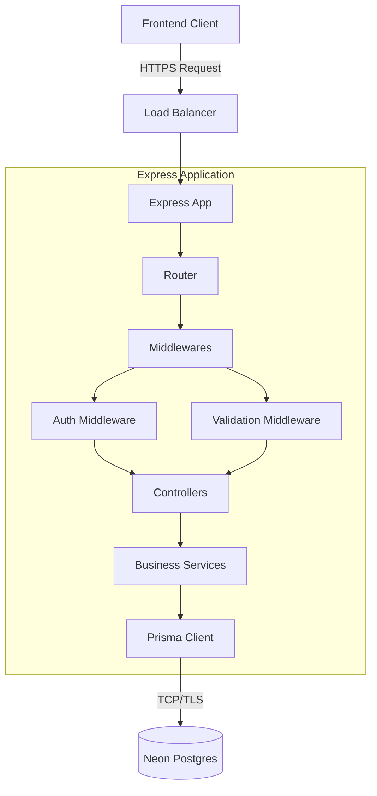

# Backend Architecture

The Studzens backend is designed to be a scalable, secure, and fast API layer connecting the React frontend to the PostgreSQL database.

## Technology Stack
- **Runtime:** Node.js
- **Framework:** Express.js (chosen for flexibility, massive ecosystem, and minimal overhead)
- **Language:** TypeScript
- **ORM:** Prisma
- **Validation:** Zod (for runtime request validation)
- **Authentication:** JWT (JSON Web Tokens)

## Core Architecture



## Folder Structure (Planned/Current)
```text
backend/
├── src/
│   ├── index.ts           # Application entry point
│   ├── app.ts             # Express app setup and middleware registration
│   ├── routes/            # API Route definitions (e.g., userRoutes.ts, collegeRoutes.ts)
│   ├── controllers/       # Route handlers extracting req/res logic
│   ├── services/          # Core business logic (keeps controllers thin)
│   ├── middlewares/       # Auth, error handling, validation blocks
│   ├── utils/             # Helper functions (e.g., token generation, hashing)
│   └── types/             # TypeScript definitions
```

## Design Principles

### 1. Thin Controllers, Fat Services
Controllers are strictly responsible for parsing the HTTP Request, calling a Service, and returning an HTTP Response. They contain **no business logic**. All business logic (e.g., checking if a user is eligible for an exam) resides in the `services/` layer, making it highly testable and reusable.

### 2. Centralized Error Handling
Errors thrown anywhere in the application are caught by an `asyncHandler` wrapper and forwarded to a global Error Handling Middleware. This ensures consistent error response formats across all endpoints.

### 3. Middleware-Driven Security
Authentication and Authorization are decoupled from business logic. A route is protected simply by injecting `requireAuth` into the router chain.

## Scalability Strategy
- **Statelessness:** The backend relies entirely on JWTs for session management. Because no session state is stored in memory, the backend can be horizontally scaled infinitely across multiple containers/instances.
- **Connection Pooling:** Prisma is configured to handle connection pooling efficiently, especially crucial in serverless or highly concurrent environments to prevent overwhelming the Postgres database.
