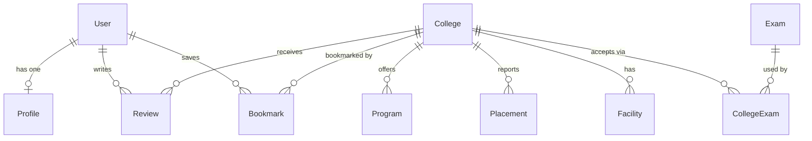

# Studzens — Database Architecture

## Overview

The database layer is managed by **Django ORM** connected to **Neon PostgreSQL** (serverless database). It contains:

- **`backend/api/models.py`** — Authoritative Django ORM data models
- **`backend/api/migrations/`** — Automated versioned DB migrations
- **`backend/seed.py`** — Database seeding script for colleges, exams, programs, facilities, and admin users

---

## Data Model ER Diagram



---

## Django ORM Models

### `User` (Custom AbstractBaseUser)
| Field | Type | Notes |
|---|---|---|
| `id` | UUIDField | Primary key (auto UUID4) |
| `email` | EmailField | Unique, USERNAME_FIELD |
| `name` | CharField | Display name |
| `role` | CharField | `STUDENT` \| `ADMIN` \| `MODERATOR` |
| `is_active` | BooleanField | Default `True` |
| `is_staff` | BooleanField | Default `False` |
| `created_at` | DateTimeField | Auto timestamp |

### `Profile`
| Field | Type | Notes |
|---|---|---|
| `id` | UUIDField | Primary key |
| `user` | OneToOneField | FK → User (cascade delete) |
| `target_stream` | CharField | e.g. "Computer Science" |
| `target_year` | IntegerField | Graduation target year |
| `city` | CharField | Home city |
| `state` | CharField | Home state |

### `College`
| Field | Type | Notes |
|---|---|---|
| `id` | UUIDField | Primary key |
| `name` | CharField | Full official name |
| `short_name` | CharField | e.g. "IIT Bombay" |
| `established_year` | IntegerField | |
| `city` | CharField | Indexed |
| `state` | CharField | Indexed |
| `tier` | CharField | `TIER_1` \| `TIER_2` \| `TIER_3` (Indexed) |
| `ownership` | CharField | `GOVERNMENT` \| `PRIVATE` \| `SEMI_GOVERNMENT` (Indexed) |
| `campus_size` | CharField | e.g. "550 Acres" |
| `faculty_count` | IntegerField | |
| `website` | URLField | |
| `nirf_rank` | IntegerField | |
| `avg_package_lpa` | FloatField | |
| `annual_fee_lpa` | FloatField | |

### `Program`
| Field | Type | Notes |
|---|---|---|
| `id` | UUIDField | Primary key |
| `college` | ForeignKey | FK → College (cascade delete) |
| `name` | CharField | e.g. "Computer Science and Engineering" |
| `type` | CharField | `BTECH` \| `MTECH` \| `BBA` \| `MBA` \| `MBBS` \| `BA` \| `MA` |
| `duration` | IntegerField | Years |
| `annual_fee` | IntegerField | INR |
| `intake` | IntegerField | Seats |

### `Placement`
| Field | Type | Notes |
|---|---|---|
| `id` | UUIDField | Primary key |
| `college` | ForeignKey | FK → College (cascade delete) |
| `year` | IntegerField | Academic year |
| `avg_package_lpa` | FloatField | LPA |
| `highest_package` | FloatField | LPA |
| `placement_rate` | FloatField | Percentage |

### `Exam`
| Field | Type | Notes |
|---|---|---|
| `id` | UUIDField | Primary key |
| `name` | CharField | Unique, e.g. "JEE Advanced" |
| `full_name` | CharField | |
| `level` | CharField | "National" or "State" |

### `CollegeExam`
Through model linking `College` and `Exam`. Unique together constraint on `(college, exam)`.

### `Review`
| Field | Type | Notes |
|---|---|---|
| `id` | UUIDField | Primary key |
| `user` | ForeignKey | FK → User |
| `college` | ForeignKey | FK → College |
| `rating` | IntegerField | 1–5 stars |
| `content` | TextField | Review content |

### `Bookmark`
| Field | Type | Notes |
|---|---|---|
| `id` | UUIDField | Primary key |
| `user` | ForeignKey | FK → User |
| `college` | ForeignKey | FK → College |
| `category` | CharField | `Dream` \| `Target` \| `Safety` |

Unique constraint on `(user, college)`.

### `Facility`
| Field | Type | Notes |
|---|---|---|
| `id` | UUIDField | Primary key |
| `college` | ForeignKey | FK → College |
| `name` | CharField | e.g. "Hostel & Dining" |
| `has_facility` | BooleanField | Default `True` |
| `details` | TextField | Facility details |

---

## Commands

```bash
# Generate migrations after model edits
python backend/manage.py makemigrations api

# Apply migrations to database
python backend/manage.py migrate

# Seed database with sample data
python backend/seed.py
```
