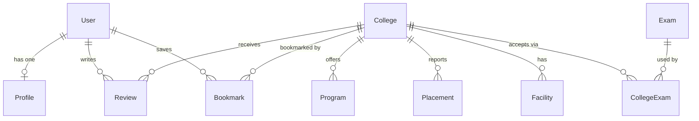

# Studzens — Database Architecture

## Overview

The `@studzens/database` package owns the entire data layer. It contains:

- **`prisma/schema.prisma`** — the authoritative data model
- **`prisma/seed.ts`** — seed data for 100+ colleges, 50+ exams, programmes, and placements
- **`prisma.config.ts`** — reads `DATABASE_URL` from `.env`

The target database is **Neon** (serverless PostgreSQL), accessed via the `@prisma/adapter-pg` driver adapter.

---

## Data Model



---

## Models

### `User`
| Field | Type | Notes |
|---|---|---|
| `id` | String (UUID) | Primary key |
| `email` | String | Unique |
| `passwordHash` | String? | Nullable (OAuth users may not have password) |
| `name` | String | Display name |
| `role` | Enum | `STUDENT` \| `ADMIN` \| `MODERATOR` |
| `createdAt` | DateTime | Auto |
| `updatedAt` | DateTime | Auto |

### `Profile`
| Field | Type | Notes |
|---|---|---|
| `userId` | String | FK → User (1-to-1, cascade delete) |
| `targetStream` | String? | e.g. "Engineering", "Medical" |
| `targetYear` | Int? | Graduation target year |
| `city` | String? | Home city |
| `state` | String? | Home state |

### `College`
| Field | Type | Notes |
|---|---|---|
| `id` | String (UUID) | Primary key |
| `name` | String | Full official name |
| `shortName` | String? | e.g. "IIT-B" |
| `establishedYear` | Int? | |
| `city` | String | |
| `state` | String | |
| `tier` | Enum | `TIER_1` \| `TIER_2` \| `TIER_3` |
| `ownership` | Enum | `GOVERNMENT` \| `PRIVATE` \| `SEMI_GOVERNMENT` |
| `campusSize` | String? | e.g. "550 acres" |
| `facultyCount` | Int? | |
| `website` | String? | |

Indexed on `(city, state)` and `tier`.

### `Program`
| Field | Type | Notes |
|---|---|---|
| `collegeId` | String | FK → College (cascade delete) |
| `name` | String | e.g. "Computer Science & Engineering" |
| `type` | Enum | `BTECH` \| `MTECH` \| `BBA` \| `MBA` \| `MBBS` \| `BA` \| `MA` |
| `duration` | Int | Years |
| `annualFee` | Int | INR |
| `intake` | Int? | Seats per year |

### `Placement`
| Field | Type | Notes |
|---|---|---|
| `collegeId` | String | FK → College |
| `year` | Int | Academic year |
| `avgPackageLpa` | Float | Average package in LPA |
| `highestPackage` | Float? | Highest package in LPA |
| `placementRate` | Float? | Percentage (0–100) |

### `Exam`
| Field | Type | Notes |
|---|---|---|
| `id` | String (UUID) | Primary key |
| `name` | String | Unique, e.g. "JEE Advanced" |
| `fullName` | String? | |
| `level` | String | "National" or "State" |

### `CollegeExam` (join table)
Many-to-many between `College` and `Exam`. Composite PK on `(collegeId, examId)`.

### `Review`
| Field | Type | Notes |
|---|---|---|
| `userId` | String | FK → User |
| `collegeId` | String | FK → College |
| `rating` | Int | 1–5 |
| `content` | Text | Full review text |

### `Bookmark`
| Field | Type | Notes |
|---|---|---|
| `userId` | String | FK → User |
| `collegeId` | String | FK → College |
| `category` | String | Default `"Target"` (Dream / Target / Safety) |

Unique constraint on `(userId, collegeId)`.

### `Facility`
| Field | Type | Notes |
|---|---|---|
| `collegeId` | String | FK → College |
| `name` | String | e.g. "Boys Hostel", "Gym" |
| `hasFacility` | Boolean | Default `true` |
| `details` | Text? | Additional notes |

---

## Enums

| Enum | Values |
|---|---|
| `Role` | `STUDENT`, `ADMIN`, `MODERATOR` |
| `Tier` | `TIER_1`, `TIER_2`, `TIER_3` |
| `Ownership` | `GOVERNMENT`, `PRIVATE`, `SEMI_GOVERNMENT` |
| `ProgramType` | `BTECH`, `MTECH`, `BBA`, `MBA`, `MBBS`, `BA`, `MA` |

---

## Scripts

```sh
npx prisma generate    # Regenerate the Prisma Client after schema changes
npx prisma db push     # Push schema to the database (dev)
npm run db:seed        # Run seed.ts to populate all tables
npx prisma studio      # Open Prisma Studio GUI (localhost:5555)
```
