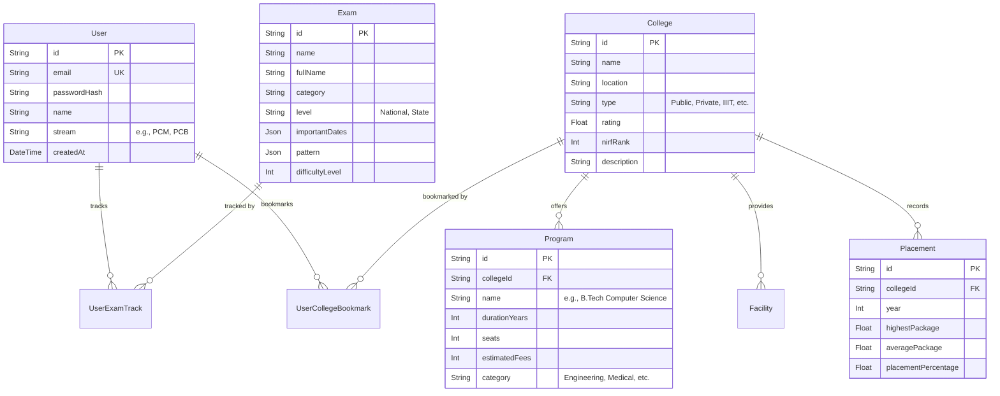

# Database Architecture

The Studzens database is built on **PostgreSQL**, hosted on **Neon**, and managed via **Prisma ORM**.

## Technology Choices
- **PostgreSQL:** Chosen for its robust relational features, ACID compliance, and rich JSON support (used for storing nested pattern structures of exams).
- **Neon:** A serverless Postgres provider. It separates compute from storage, meaning it can auto-suspend when idle to save costs and auto-scale instantly when traffic spikes.
- **Prisma:** Provides a strongly-typed database client and a declarative schema definition, minimizing runtime errors and simplifying migrations.

## Entity Relationship Diagram (ERD)

## Schema Highlights

### `College`
Acts as the central entity for educational institutions. Because queries often involve filtering by `type` or `location`, appropriate indexes are established on these columns to speed up dashboard queries.

### `Program`
Instead of flattening degrees into the `College` model, `Program` is extracted into its own table. This allows users to search directly for "B.Tech Computer Science" across multiple colleges, filtering by `estimatedFees`.

### `Exam`
Exams have highly variable structures (some have 3 sections, some have 5; dates change frequently). By utilizing Postgres's `JSONB` capabilities (mapped via Prisma's `Json` type), we can store the `importantDates` and `pattern` flexibly without requiring massive schema migrations every time an exam changes its format.

## Seeding Strategy
The database is initially populated using the `prisma/seed.ts` file, which contains a rich dataset of 51 top Indian colleges (IITs, NITs, BITS, etc.) with real-world placement records spanning 2022-2024. This ensures new developers can immediately work with realistic data.
