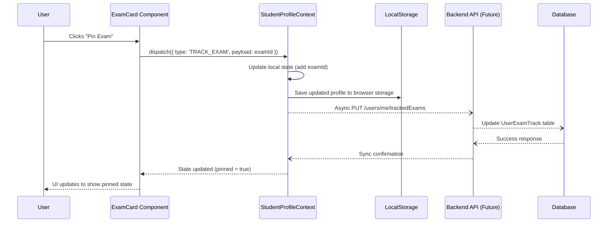
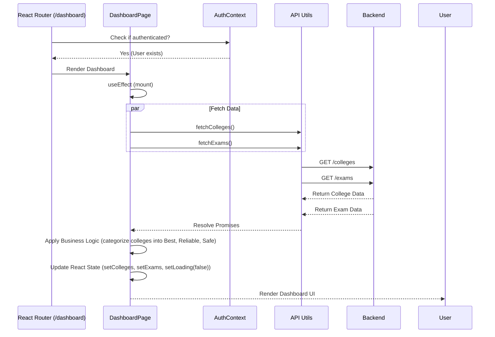
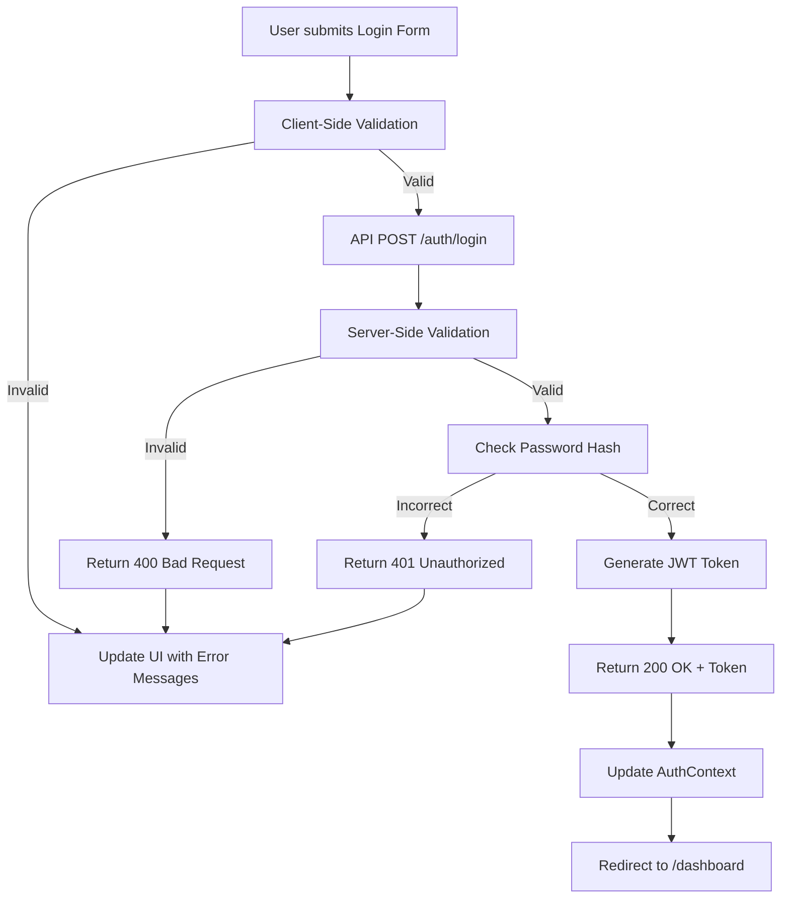

# Data Flow Diagrams

This document illustrates how data moves through the Studzens application during key operations.

## 1. Exam Tracking Flow

When a user clicks "Pin Exam" in the Exam Hub.

## 2. Dashboard Data Loading Flow

When a user navigates to `/dashboard`.

## 3. Form Validation & Submission Flow (Login)

