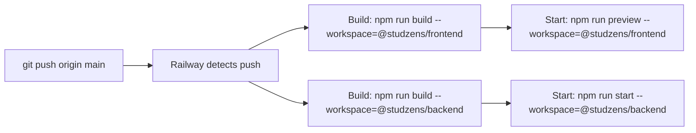

# Studzens — Deployment Architecture

## Overview

Studzens uses **Railway** to host both the frontend (as a Vite preview server) and the backend (as a Node.js service). The database runs on **Neon** (serverless PostgreSQL). 
Alternatively, the frontend can be seamlessly deployed on **Vercel** (recommended for production static SPAs).

---

## Services

| Service | Package | Platform | Start Command |
|---|---|---|---|
| Frontend | `@studzens/frontend` | Railway or Vercel | `npm run preview --workspace=@studzens/frontend` (Railway) / Auto (Vercel) |
| Backend | `@studzens/backend` | Railway | `npm run start --workspace=@studzens/backend` |
| Database | `@studzens/database` | Neon (external) | — managed by Neon |

---

## Frontend Deployment to Vercel (Alternative)

Deploying the frontend SPA on Vercel is highly recommended for edge caching and performance. 

### Resolving the "404 NOT_FOUND" Routing Error
Since Studzens uses client-side routing (React Router), you must configure Vercel to route all unknown paths to `index.html`. A `vercel.json` file is provided in the `frontend` directory for this purpose:

```json
{
  "rewrites": [
    {
      "source": "/(.*)",
      "destination": "/index.html"
    }
  ]
}
```

### Vercel Project Settings (Crucial)
Because this is a monorepo, Vercel will ignore `frontend/vercel.json` **unless you configure the Root Directory**.
1. In your Vercel Dashboard, go to your project **Settings** → **General**.
2. Scroll to **Root Directory** and click Edit.
3. Select the `frontend` folder and save.
4. Vercel will automatically detect Vite and apply the `vercel.json` routing configuration correctly.

---

## Environment Variables

### Frontend (Railway)
| Variable | Required | Description |
|---|---|---|
| `PORT` | Set by Railway | The preview server reads this via `${PORT:-4173}` inside the npm script |

### Backend (Railway)
| Variable | Required | Description |
|---|---|---|
| `DATABASE_URL` | ✅ | Full Neon connection string including `?sslmode=require` |
| `PORT` | Set by Railway | Defaults to `3000` if not set |

---

## Frontend Deployment Note (Railway)

The `preview` script in `frontend/package.json` is:

```json
"preview": "vite preview --host 0.0.0.0 --port ${PORT:-4173}"
```

**Why this matters:** Passing `--port $PORT` via a Railway run command results in a `CACError` because the shell variable is not expanded before npm passes it to Vite. The `${PORT:-4173}` syntax inside the script ensures the shell running the script expands the variable correctly, with a fallback to `4173` (Vite's default) for local use.

---

## Deployment Flow



---

## Infrastructure

```
Internet
    │
    ├── *.vercel.app / *.railway.app ──→ Vite SPA
    │                              
    │
    └── *.railway.app/backend  ──→ Express API (Node 22)
                                   PORT env var from Railway
                                   DATABASE_URL → Neon Postgres
```

---

## Local Development

```sh
# Install all workspaces
npm install

# Start frontend dev server (hot reload)
npm run dev --workspace=@studzens/frontend   # http://localhost:5173

# Start backend dev server (tsx watch)
npm run dev --workspace=@studzens/backend    # http://localhost:3000

# Or start both simultaneously
npm run dev   # runs dev in all workspaces
```
