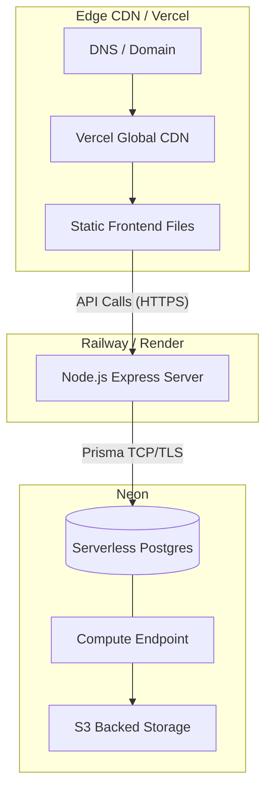

# Deployment Architecture

The deployment architecture of Studzens utilizes a modern, serverless-first approach to maximize performance, reduce operational overhead, and ensure infinite scalability.

## Overview

## 1. Frontend Hosting: Vercel
- **Why Vercel?** Vercel provides zero-configuration deployment for Vite/React applications. It automatically deploys code pushed to the `main` branch.
- **Routing Configuration:** Because Studzens is an SPA, a `vercel.json` file is placed in the frontend root to rewrite all unmatched routes to `index.html`, allowing React Router to handle client-side routing without triggering 404s.
- **Edge Caching:** Static assets (JS, CSS, Images) are cached at the edge globally, meaning users in India load the application UI in milliseconds.

## 2. Backend Hosting: Railway / Render (Planned)
- **Why Railway?** It offers simple Docker-based deployments or native Node.js builds. It scales automatically based on incoming traffic.
- **Environment Variables:** Secrets (like JWT_SECRET and DATABASE_URL) are injected securely via the hosting provider's dashboard.

## 3. Database: Neon Serverless Postgres
- **Why Neon?** Neon decouples storage and compute. If the app has low traffic at night, the compute scales down to zero, saving costs. During result days (when traffic spikes), it scales up instantly.
- **Connection Pooling:** Neon provides built-in connection pooling, which is critical because serverless backends can rapidly spin up and overwhelm standard Postgres databases with hundreds of concurrent connections.

## 4. CI/CD Pipeline
1. Developer pushes to a feature branch on GitHub.
2. Vercel automatically creates a "Preview Deployment" (a unique URL for testing the branch).
3. Pull Request is merged into `main`.
4. Vercel triggers a Production Build.
5. Railway detects the push to `main` and deploys the new backend container.
6. The new version is live to users with zero downtime.
