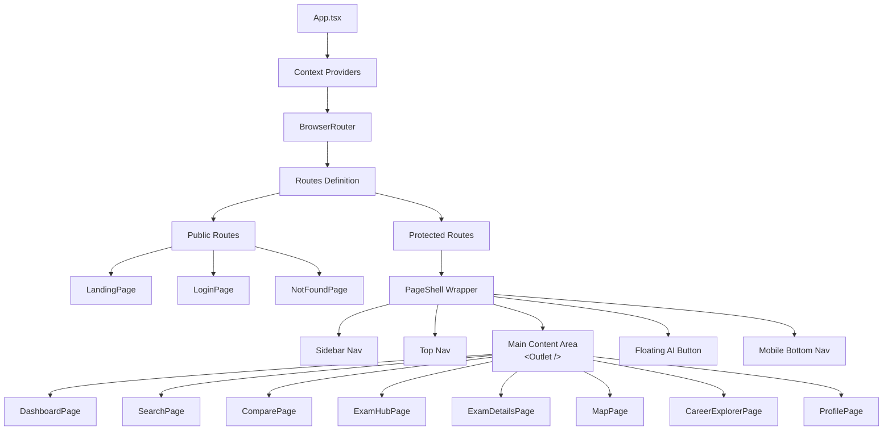

# Frontend Architecture

The Studzens frontend is a modern, responsive Single Page Application (SPA) built to deliver a premium user experience. It prioritizes fast load times, seamless client-side transitions, and clean aesthetics.

## Technology Stack
- **Framework:** React 18
- **Build Tool:** Vite (chosen for lightning-fast HMR and optimized production bundling)
- **Language:** TypeScript (strict mode enabled for maximum type safety)
- **Styling:** Tailwind CSS (utility-first, standardizing design tokens across the app)
- **Routing:** React Router v6 (`react-router-dom`)
- **Icons:** Lucide React
- **Maps:** MapLibre GL (for geographic visualization of colleges)

## Application Layout Architecture

The application uses a nested routing architecture to maintain persistent layouts while swapping out page content.

## Routing Strategy
Routing is handled in `src/App.tsx`.
- **Public Routes:** Accessible without authentication (Landing, Login, Onboarding).
- **Protected Routes:** Wrapped in a custom `ProtectedRoute` component that checks the `AuthContext`. If unauthenticated, the user is redirected to `/login`.
- **Layout Wrapper:** All protected routes share the `PageShell` layout. The actual page content is rendered into the `<Outlet />` provided by React Router.

## Component Architecture

Components are grouped logically by feature or function:
- `src/components/layout/`: Structural components like navigation bars (`PageShell`).
- `src/pages/`: Top-level route components. They act as container components, managing data fetching and layout structure for specific views.
- `src/components/features/`: (Planned) Reusable chunks of logic (e.g., `CollegeCard`, `ExamTimer`).

## Context & State Management
See `STATE_MANAGEMENT.md` for a deeper dive. The frontend heavily relies on React Context to avoid prop-drilling for global concerns like Authentication and User Profile settings.

## Styling & Theme
The application does not use a massive component library (like MUI or Ant Design) to avoid bloat and maintain a unique identity. Instead, it uses custom Tailwind CSS classes defined in `src/index.css`.

**Key Design Tokens:**
- **Primary Brand:** `#635BFF` (Deep Purple/Indigo)
- **Backgrounds:** `#F6F7FB` (Light Gray/Blue for main body), `#FFFFFF` (Cards)
- **Typography:** Inter/Sans-serif stack with heavy emphasis on varied font weights (extrabold for headers, medium for body).
- **Card Styling:** Elements use custom classes like `.sz-card` and `.sz-input` defined in `index.css` for consistent borders, shadows, and transitions.

## Data Fetching (Mock -> Real API)
Currently, the frontend relies on static data files located in `src/api/mocks/` (e.g., `colleges.ts`, `exams.ts`). 
The transition strategy is to build API wrapper functions (e.g., `api/colleges.ts`) that currently return Promises resolving the mock data, but will eventually be swapped out with `fetch` or `axios` calls to the backend without requiring changes to the UI components.
