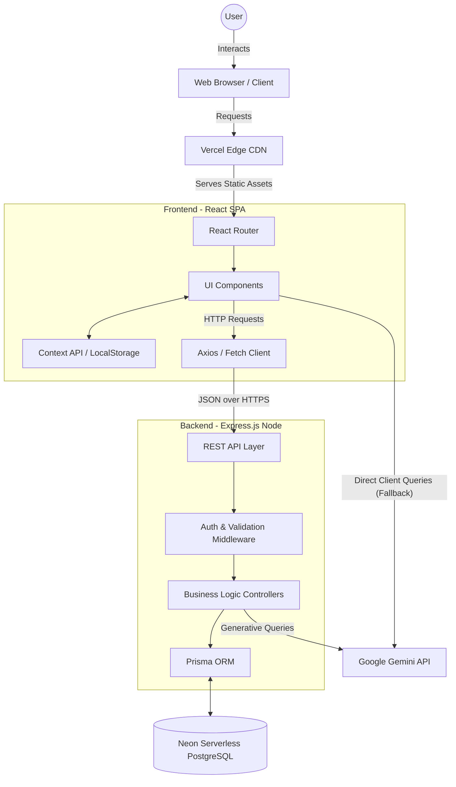

# System Architecture

This document provides a high-level overview of the entire Studzens application ecosystem, mapping the flow of data from the end-user's browser down to the database and external services.

## High-Level Architecture Diagram

## Layer Descriptions

### 1. Client Layer (Browser)
The user interacts with a responsive React Single Page Application (SPA). The UI is styled with Tailwind CSS, utilizing Lucide React for iconography. Client-side routing is handled strictly by `react-router-dom`.

### 2. Edge / Delivery Layer (Vercel)
The compiled static assets (HTML, JS, CSS) are hosted on Vercel. A `vercel.json` file ensures that all non-asset HTTP GET requests are rewritten to `/index.html` to allow React Router to manage the application state without triggering 404s.

### 3. Frontend Layer (React)
- **State Management:** Uses React Context (`AuthContext`, `StudentProfileContext`) backed by `localStorage` for persistence across sessions.
- **Components:** Modular, functional components split between Layouts (e.g., `PageShell`) and specialized features (e.g., `DashboardPage`, `ExamHubPage`).

### 4. Backend Layer (Express.js)
Currently in development/transition. The backend will serve as a robust REST API protecting database secrets and housing complex business logic.
- **Middleware:** Request validation and security.
- **Controllers:** Handling specific domains (Colleges, Exams, Users).

### 5. Data Access Layer (Prisma)
Prisma acts as the Object-Relational Mapper (ORM), providing type-safe database queries. It manages connection pooling and schema migrations.

### 6. Database Layer (Neon PostgreSQL)
A serverless PostgreSQL database hosted on Neon. Highly scalable with a separation of storage and compute, enabling fast branching and rapid scaling for read-heavy operations like college searches.

### 7. External Integrations
- **AI Services:** Integrates with LLMs (Google Gemini) for the AI Counselor feature, providing contextual advice based on the user's specific state (e.g., "What is the cut-off for NIT Warangal?").
