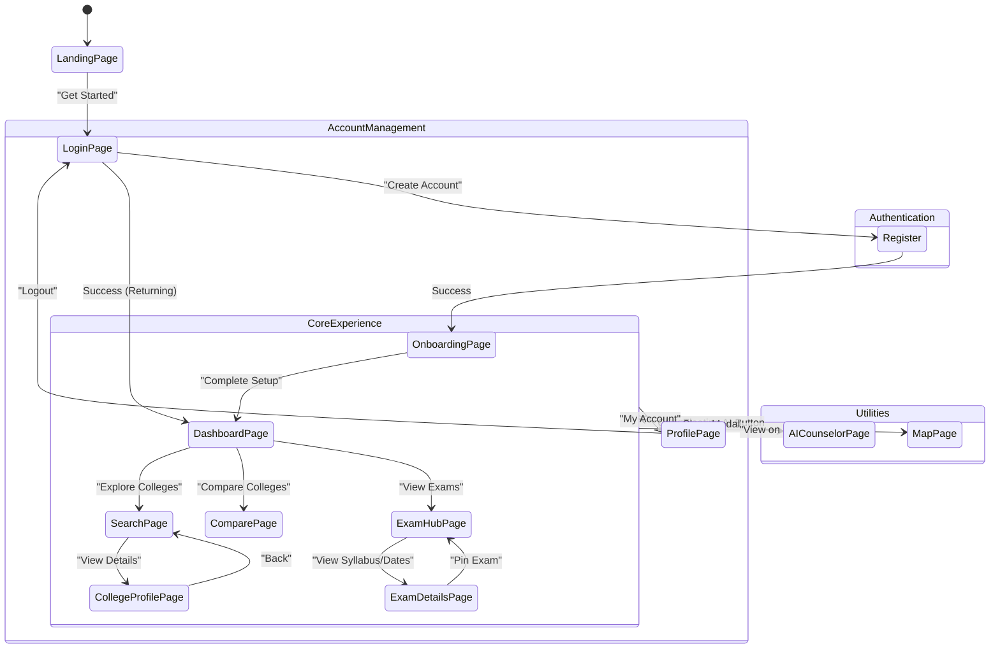

# User Journey & Flow

This document maps the complete lifecycle of a user interacting with the Studzens platform. Every screen serves a specific purpose in guiding the user from initial discovery to active daily usage.

## The Complete Lifecycle

## Screen Purposings

### 1. Landing Page
- **Purpose:** Marketing and conversion. Explain the value proposition (centralized tracking, AI counseling, verified data).
- **Goal:** Drive user to click "Get Started" and enter the authentication flow.

### 2. Onboarding Flow
- **Purpose:** Data collection. We need to know the user's current grade, target stream (e.g., Engineering, Medical), and geographical preferences.
- **Goal:** Populate the `StudentProfileContext` so that the Dashboard can immediately offer personalized college recommendations.

### 3. Dashboard (The Command Center)
- **Purpose:** The daily summary. Shows a snapshot of everything important: upcoming pinned exams (countdown timers), top 3 college recommendations split by probability (Reach, Match, Safety), and quick actions.
- **Goal:** Act as the jumping-off point for deeper exploration while providing instant value upon login.

### 4. College Directory & Search
- **Purpose:** Deep research. Allows filtering 100+ colleges by fees, location, type (Public/Private).
- **Goal:** Help users build their "Bookmarked" list of target colleges.

### 5. Exam Hub
- **Purpose:** The calendar. Tracks the chaotic schedule of Indian entrance exams.
- **Goal:** Prevent missed deadlines. Users pin exams here, which populate the countdowns on their Dashboard.

### 6. AI Counselor (Floating Button)
- **Purpose:** Unblock the user. If a user is confused about a term (e.g., "What is JoSAA counseling?"), they can ask the AI without leaving their current page.
- **Goal:** Provide instant, contextual guidance.
