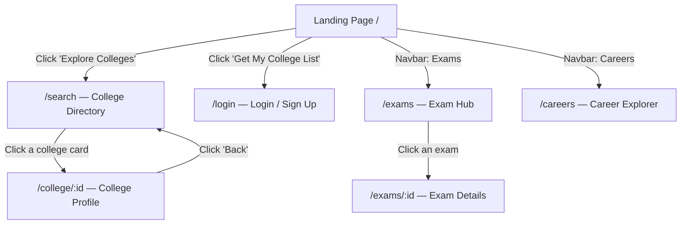
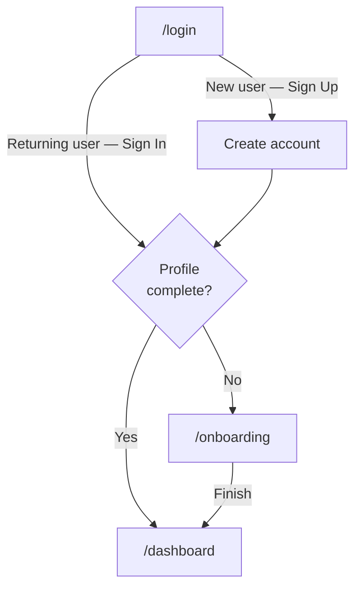
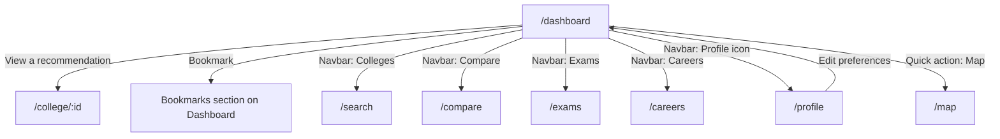

# Studzens — User Flow

## Overview

A new visitor goes through three phases: **Discover → Authenticate → Personalise → Use**.

---

## Phase 1: Discovery (Unauthenticated)

All pages above are **publicly accessible** — no login required.

---

## Phase 2: Authentication

---

## Phase 3: Personalised Experience (Authenticated)

---

## Detailed User Journeys

### Journey 1: Find My Colleges

1. User visits `/` (Landing Page)
2. Clicks **"Get My College List"**
3. Redirected to `/login` → signs up
4. Redirected to `/onboarding` — fills in stream, class, marks, exam scores, budget, preferred states
5. Redirected to `/dashboard` — sees personalised Safe Reach / Safe / Safe Backup colleges
6. Clicks a college card → `/college/:id` — full profile with programmes, placements, reviews
7. Clicks bookmark → college saved; toast notification appears

### Journey 2: Compare Two Colleges

1. From `/search`, user filters colleges by state or stream
2. Clicks "Compare" on two college cards
3. Navigated to `/compare` — side-by-side view of fee, placement, facilities, tier
4. Goes back to search to swap one college

### Journey 3: Exam Research

1. User clicks **Exams** in the navbar
2. Lands on `/exams` — full list with tabs (National / State / Scholarship)
3. Searches for "NEET" using the search bar
4. Clicks NEET card → `/exams/neet` — sees exam pattern, eligibility, important dates, syllabus

### Journey 4: Career Exploration

1. User clicks **Careers** in the navbar
2. Lands on `/careers` — grid of career paths (Engineering, Medical, Law, Commerce, etc.)
3. Clicks "Software Engineer" — sees required exams, associated colleges, avg salary
4. Clicks an exam link → `/exams/:id` for more detail

---

## Route Protection

`ProtectedRoute` wraps all authenticated routes. Any unauthenticated attempt to visit `/dashboard`, `/profile`, `/compare`, `/map`, or `/onboarding` triggers an immediate redirect to `/login`.

After successful login, the user is sent to `/dashboard` if they have a profile, or `/onboarding` if they don't.

---

## Mobile Navigation

On screens narrower than `lg` (1024px):

- The sticky header shows only the **logo** and a **hamburger** button (when authenticated)
- A **bottom tab bar** (fixed, `z-9999`) provides quick access to: Home, Colleges, Compare, Exams, Profile
- The hamburger opens a full-height dropdown with all nav links
